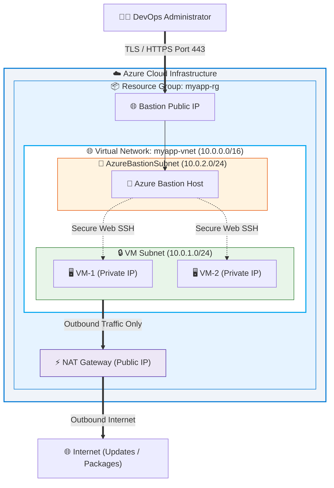

<div align="center">

# ☁️ Azure Infrastructure with Terraform

<p align="center">
  <strong>Production-Ready, Modular Azure Cloud Architecture featuring Private VMs, Azure Bastion & NAT Gateway</strong>
</p>

<p align="center">
  <a href="https://terraform.io"></a>
  <a href="https://azure.microsoft.com"></a>
  <a href="https://www.linux.org"></a>
  <a href="https://github.com"></a>
  <a href="https://opensource.org/licenses/MIT"></a>
</p>

---

</div>

## 📌 Table of Contents
- [📖 Overview](#-overview)
- [🏗️ Architecture & Diagram](#️-architecture--diagram)
- [✨ Key Features](#-key-features)
- [📁 Project Structure](#-project-structure)
- [🚀 Quick Start & Deployment](#-quick-start--deployment)
- [⚙️ Configuration Parameters](#️-configuration-parameters)
- [📤 Deployment Outputs](#-deployment-outputs)
- [🛡️ Security Best Practices](#️-security-best-practices)
- [🧹 Clean Up](#-clean-up)

---

## 📖 Overview

This repository contains a **modular, production-grade Infrastructure as Code (IaC)** deployment using **Terraform** on **Microsoft Azure**.

It provisions a highly secure network environment featuring **isolated Linux Virtual Machines** without public IP addresses, outbound internet connectivity via an **Azure NAT Gateway**, and zero-trust remote administration via **Azure Bastion**.

---

## 🏗️ Architecture & Diagram



---

## ✨ Key Features

- 🛡️ **Zero Public IP VMs**: Linux VMs are provisioned purely with Private IP addresses, eliminating direct attack surfaces from the internet.
- ⚡ **Azure NAT Gateway**: Provides predictable, secure outbound SNAT internet connectivity for package installations, OS updates, and patches.
- 🏰 **Azure Bastion Host**: Seamless, secure RDP/SSH access directly through the Azure Portal via TLS (Port 443) without exposing SSH port 22 publicly.
- 🧩 **Modular Design**: Decoupled Terraform code logic across standard module blueprints for scalability and reuse.
- 🏷️ **Unified Tagging**: Consistent metadata tagging across all deployed Azure resources for easy environment lifecycle tracking.

---

## 📁 Project Structure

```text
.
├── main.tf                 # Main terraform configuration orchestrating modules
├── variables.tf            # Input variable definitions & default values
├── outputs.tf              # Infrastructure deployment output definitions
├── providers.tf            # AzureRM provider configuration & constraints
├── terraform.tfvars        # Environment variable values (git-ignored)
├── terraform.tfvars.example# Example template for terraform.tfvars
└── README.md               # Project documentation
```

---

## 🚀 Quick Start & Deployment

### 📋 Prerequisites
- 🛠️ [Terraform CLI](https://developer.hashicorp.com/terraform/downloads) (`>= 1.0.0`)
- ☁️ [Azure CLI](https://learn.microsoft.com/en-us/cli/azure/install-azure-cli) logged in (`az login`)
- 🔑 Active Azure Subscription with resource provisioning permissions

### 🛠️ Execution Steps

> [!NOTE]
> Ensure you set your sensitive administrator credentials in `terraform.tfvars` before running `terraform apply`.

```bash
# 1️⃣ Clone the repository
git clone <your-repository-url>
cd 18august

# 2️⃣ Initialize Terraform provider plugins & modules
terraform init

# 3️⃣ Create terraform.tfvars file from example
cp terraform.tfvars.example terraform.tfvars
# Edit admin_password and prefix in terraform.tfvars

# 4️⃣ Generate & review execution plan
terraform plan -out=tfplan

# 5️⃣ Apply the infrastructure plan
terraform apply tfplan
```

---

## ⚙️ Configuration Parameters

### 📥 Input Variables

| Variable Name | Type | Default Value | Description |
| :--- | :---: | :---: | :--- |
| 🏷️ `prefix` | `string` | `"myapp"` | Prefix applied to all Azure resource names |
| 📍 `location` | `string` | `"East US"` | Azure Target Region for infrastructure deployment |
| 🌐 `vnet_address_space` | `list(string)` | `["10.0.0.0/16"]` | Virtual Network CIDR block range |
| 🔒 `vm_subnet_address_prefix` | `list(string)` | `["10.0.1.0/24"]` | Subnet CIDR block reserved for Linux VMs |
| 🏰 `bastion_subnet_address_prefix` | `list(string)` | `["10.0.2.0/24"]` | Subnet CIDR block reserved for Azure Bastion |
| 🖥️ `vm_count` | `number` | `2` | Number of private Linux VMs to deploy |
| ⚡ `vm_size` | `string` | `"Standard_B1s"` | Azure Virtual Machine SKU size |
| 👤 `admin_username` | `string` | `"azureuser"` | Default admin SSH username |
| 🔐 `admin_password` | `string` | *Sensitive* | Admin password meeting Azure complexity rules |
| 🏷️ `tags` | `map(string)` | `{ Environment = "Practice", ManagedBy = "Terraform" }` | Common resource tags |

---

## 📤 Deployment Outputs

| Output Name | Type | Description |
| :--- | :---: | :--- |
| 📦 `resource_group_name` | `string` | Name of the created Azure Resource Group |
| 🌐 `vnet_name` | `string` | Name of the Virtual Network |
| 🖥️ `vm_private_ips` | `list(string)` | Private IP addresses assigned to deployed VMs |
| ⚡ `nat_gateway_public_ip` | `string` | Public IP allocated for NAT Gateway outbound traffic |
| 🏰 `bastion_public_ip` | `string` | Public IP address of the Azure Bastion service |
| 🔗 `bastion_dns_name` | `string` | Fully Qualified Domain Name (FQDN) for Azure Bastion |

---

## 🛡️ Security Best Practices

> [!IMPORTANT]
> **Production Security Guidelines**:
> 1. Never commit `terraform.tfvars` containing actual secrets or passwords to Git.
> 2. Ensure remote state storage (Azure Storage Account Blob Container with state locking) is configured for team collaboration.
> 3. Use SSH key pairs instead of password authentication for production VM deployments.

---

## 🧹 Clean Up

To destroy all Azure resources created by this Terraform workspace and avoid recurring charges:

```bash
terraform destroy -auto-approve
```

---

<div align="center">
  <sub>Built with ❤️ using Terraform & Azure Cloud</sub>
</div>